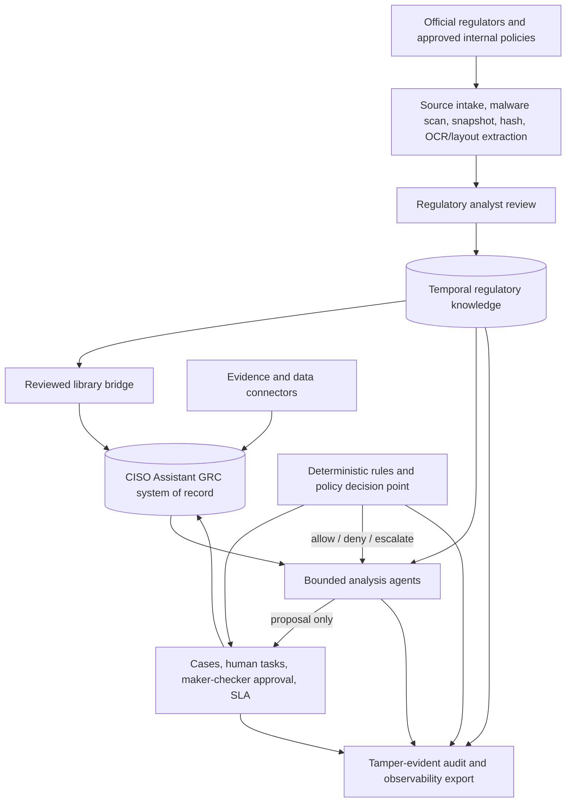

# Target architecture

## Architecture decision

CISO Assistant remains the GRC system of record for controls, assessments,
evidence, findings, risks, actors, folders, and validation flows. A dedicated
regulatory knowledge layer is proposed beside the existing library model instead
of forcing legal documents into cybersecurity framework objects.



## Layer responsibilities

| Layer | Authoritative for | Must not do |
| --- | --- | --- |
| Source intake | source URL, bytes, content hash, retrieval time, page/section anchors | treat webpage instructions as executable prompts |
| Regulatory knowledge | document versions, provisions, obligations, applicability, deadlines, legal provenance | silently overwrite a previous legal version |
| CISO Assistant | controls, implementation, assessments, evidence, findings, risks, ownership | become the only copy of legal source text or applicability logic |
| Rules/policy | thresholds, date arithmetic, scoring, routing, permissions, action gates | infer law from natural language |
| Agent | extraction proposals, comparison, explanation, draft artifacts | perform consequential writes or final legal approval |
| Workflow | human tasks, segregation of duties, approval, escalation, SLA | allow an agent to approve its own proposal |
| Evidence connectors | observed facts and signed/hash-addressed artifacts | declare a legal or audit conclusion from one scan |
| Audit/telemetry | inputs, citations, rules, approvals, tool calls, outcomes, cost | store hidden model chain-of-thought or unredacted secrets |

## Fit with the current repository

CISO Assistant already provides several strong foundations:

- `StoredLibrary`, `LoadedLibrary`, `Framework`, `RequirementNode`, and
  `ReferenceControl` for reviewed control content;
- `ComplianceAssessment` and `RequirementAssessment` for assessment state;
- `AppliedControl`, `Evidence`, `EvidenceRevision`, `Finding`, and task models
  for implementation and remediation;
- folder-scoped IAM and validation flows;
- an AI chat layer based on deterministic pre-routing, permission-filtered
  retrieval, and proposals rather than direct mutation;
- workflow scaffolding and structured application logging. Audit-log and
  service-account features have edition dependencies, so production must
  explicitly select an edition or provide equivalent external controls.

The extension should preserve those boundaries.

## Implemented Phase 1 boundary

The current as-built regulatory layer is the bounded `backend/regulatory`
Django app. It owns a synthetic, metadata-only Document -> DocumentVersion ->
Provision -> Obligation aggregate, entity registration, append-only non-binding
review events, controlled recorded-time correction, and current/historical
read selection. CISO Assistant continues to own users, service accounts,
folders, IAM, and the synthetic `tprm.Entity`; no parallel IAM, workflow, or GRC
store is introduced.

The public `/api/regulatory/v1/` surface remains read-only. Its detail operation
accepts an optional timezone-aware `recorded_as_of`, resolves one coherent
folder-consistent revision chain with half-open recorded intervals, and limits
review events to the same selection time. The detail path preserves both object
IAM and related-field masking. Missing or ambiguous aggregates fail closed.

The fork-specific SvelteKit frontend now exposes the corresponding read-only
register at `/regulatory` and document viewer at `/regulatory/{uuid}`. These
routes make only server-side GET requests to the existing API, apply runtime
response contracts, and keep the generic entity list as a discovery aid rather
than an authorisation source. The backend remains authoritative for document,
entity, registration, folder, decision, and reviewer IAM. A coherence gate
binds successful responses to the requested document, entity, exact obligation
revision, recorded-time selection, and decision digest; mismatched responses
are discarded rather than combined. Metadata-only contracts do not hydrate
provision text or free-text version notes into the browser, and official-source
links must remain HTTPS. Current applicability is resolved first and its
Django-microsecond selection instant anchors the review read; unique chain
cardinality, parent reference, shared revision epoch, half-open intervals, and
strict calendar timestamps fail closed. The UI presents decision valid time
separately from recorded time. It can display the computed result and the
independent human disposition, but it has no correction, approval, publication,
export, submission, or other mutation action.

Recorded-time repair is an internal deterministic domain operation, not an
agent or public write endpoint. A named human with the folder-scoped correction
permission may submit one complete typed successor set for a `SYNTHETIC-*`
entity. The transaction locks the actor, entity/folder, registration and full
aggregate, chooses one server cutoff, closes all three current revisions, adds
linked successors, and records an immutable correction event with semantic
before/after hashes. Corrected obligations restart at `machine_proposed`, so a
previous review cannot silently endorse new content.

The folder is the aggregate concurrency boundary. Mutations acquire it before
child rows; detail reads acquire the same lock before capturing their selection
time. Review/correction timestamps advance after the aggregate's latest known
recorded event, and reads floor wall time at the latest committed aggregate
time. This provides a defined before-or-after result for a concurrent current
read and correction and prevents clock rollback from hiding committed state.
Repository-local PostgreSQL 16 acceptance now proves two-connection
linearisation and existing-index usability for the bounded synthetic slice;
SQLite tests were not used as that evidence. Representative production-volume
plans, target topology, recovery, retention, and named operational approval
remain external production gates.

This verified as-built subset does not own source bytes or legal supersession,
binding decisions, approval/publication, real institution facts, library
projections, UI writes, a binding reviewer action workflow, or agent execution.
Those remain target components gated by the delivery roadmap. The exact
correction decision is in
[ADR 0002](adr/0002-recorded-time-correction.md).

## Implemented bounded Phase 1 applicability boundary

`backend/regulatory` owns one append-only
`RegulatoryApplicabilityDecision` aggregate rather than separate rule,
fact-snapshot, decision, evidence-link, and invalidation tables. Migration
`regulatory.0003` adds this table without a data backfill or institution fact
records.

The aggregate is limited to one synthetic legal-entity scope registered to the
document and one exact physical obligation revision. It embeds:

- fixed rule `SYNTHETIC-ENTITY-INSTITUTION-TYPE-BANK-001` version 1, whose only
  condition is `entity.institution_type eq "bank"`;
- the canonical fact observation, including known/unknown state, value,
  evidence references, and observation time;
- the recomputed three-value result, structured reasons, valid and recorded
  time, actor and provenance;
- versioned rule, fact, semantic, and request digests, a predecessor revision,
  compare-and-swap expectations, and a folder-scoped idempotency key; and
- explicit `draft`, non-binding, unpublished markers.

The caller supplies a fact observation, not a rule or authoritative result.
Known `"bank"` computes `applicable`, another known non-matching value computes
`not_applicable`, and a missing or unknown observation computes
`needs_review`. Evidence references identify supporting material but do not
copy evidence bytes or change CISO Assistant's ownership of `Evidence` and
`EvidenceRevision`.

The public surface remains read-only. The implemented entity-scoped action is:

```text
GET /api/regulatory/v1/documents/{uuid}/applicability/?entity=<uuid>&recorded_as_of=<aware-RFC-3339>
```

It requires document and entity IAM plus the separate Django
`view_regulatoryapplicabilitydecision` permission. The internal write service
requires folder-scoped `record_regulatoryapplicability`; it is not a public API
and accepts only an authenticated named human. It cannot approve, confirm,
publish, or bind a legal conclusion. The stable entity UUID is the scope
identifier, and the immutable entity-document registration retains the folder
IAM boundary used to retrieve historical decisions even if mutable entity
metadata later changes.

Recorded-time selection first resolves the existing coherent chain and then
selects a decision through that exact physical obligation and explicit entity
registration at the same timestamp. The effective interval is the intersection
of the decision and parent obligation recorded intervals. When an obligation
r1 is corrected to r2, the r1 decision remains immutable historical evidence
and is not copied or attached to r2. At and after the correction cutoff, r2 has
no result until it receives a fresh evaluation; the read contract reports this
as unevaluated and safely resolves it to `needs_review`.

The chain correction therefore does not cascade-close applicability rows. A
cascade would make the three-row correction operation mutate an unbounded set
of entity decisions and would obscure its existing audit boundary. A separate
applicability correction event is also unnecessary in this slice because every
successor decision itself retains its direct predecessor, server cutoff, actor,
rationale, idempotency binding, and canonical digests. See
[ADR 0003](adr/0003-bounded-synthetic-applicability-persistence.md).

At the preceding ADR 0003 delivery gate, the full regulatory SQLite suite
passed all 41 then-existing tests both with migrations disabled and through the
real project migration graph. An independent full-project SQLite migration
rehearsal verified 0003 apply, empty-history rollback and reapply, and the
populated-history reverse guard.
Django system checks, migration-drift checks, and an independent review
reporting no critical, high, or medium findings also pass. PostgreSQL apply,
two-connection lock evidence, representative query plans, backup/restore,
database-role enforcement, and audit-retention evidence remain external
production gates.

## Implemented bounded applicability review boundary

The bounded Phase 1 implementation remains owned by `backend/regulatory`.
Additive migration `regulatory.0004` creates an independent append-only
`RegulatoryApplicabilityReviewDisposition` event stream for a named human to
review one exact physical `RegulatoryApplicabilityDecision` revision and its
server-recomputed semantic digest.

The disposition vocabulary is deliberately narrower than legal approval:

- `no_correction_requested` means the reviewer did not request a correction to
  that exact stored synthetic record;
- `correction_requested` signals that the exact record should be superseded
  through the existing applicability correction service; and
- `unable_to_complete` records that evidence, scope, authority, or information
  prevented the bounded review from completing.

No event derives `applicable` or `not_applicable`, changes the decision's fixed
`draft`/non-binding/unpublished state, approves evidence, or establishes legal
applicability. The absence of an event derives `not_reviewed`. A later event can
correct an earlier human disposition through a predecessor/sequence chain, but
an exact semantic no-op is rejected and no history is overwritten. A same-
disposition successor is valid only when its controlled reason or rationale
materially changes under an exact predecessor compare-and-swap.

Review authority is separated from fact-recording authority. Analyst and Domain
Manager may view dispositions and record decisions but cannot review them.
Approver may view and review but cannot record a decision. Administrator may
hold both permissions, while the service still enforces reviewer identity !=
the exact decision's `recorded_by` identity. Every reviewer is an active named
human; service accounts cannot act. Reviewer identity and rationale have a
separate view permission and remain entity/folder scoped.
Reviewer identity additionally follows related-User object IAM; without it the
read contract masks the actor and discloses no UUID, name, or email.

The implemented transaction reuses the immutable registration folder as its
historical IAM boundary and locks:

```text
actor -> entity -> registration folder -> registration -> current chain
      -> exact current applicability decision -> latest disposition
```

Checking only an open applicability row is insufficient because an obligation
correction may leave the old decision row open while exact-parent selection
makes it historical. New dispositions must target the decision selected through
the current coherent chain. Exact idempotent retries may return a historical
event after later correction or entity movement, but new events require the
entity to remain in its live synthetic scope.

The document recorded-time floor includes disposition event time. A
decision correction therefore starts after its review history even under host
clock rollback. Decision d1 dispositions remain on d1; decision d2 derives
`not_reviewed`. Obligation r1 dispositions cannot appear on r2 because the read
first selects the exact applicability decision through the physical
obligation.

The implementation includes no public review write route. It adds only this
separate entity-scoped read action:

```text
GET /api/regulatory/v1/documents/{uuid}/applicability-review/
    ?entity=<uuid>&recorded_as_of=<aware-RFC-3339>
```

It first uses the existing applicability selector, then selects the latest
authorised disposition at the same recorded timestamp. The computed result and
human disposition are returned as separate non-binding fields. The existing
applicability endpoint remains backward compatible and does not disclose review
history to custom roles lacking the new disposition-view permission.

The additive migration, internal service, read action, IAM mapping, SQLite
tests, and empty/populated-history rollback contract are implemented. With
ADR 0004 included, all 72 regulatory tests pass both with migrations disabled
and through the real project migration graph. An isolated full-project SQLite
rehearsal verified 0004 apply, empty rollback/reapply, populated-history reverse
refusal, and preservation of the applied migration and event after that refusal.
The PostgreSQL migration, two-connection locking, query-plan, backup/restore,
least-privilege database-role, and tamper-evident audit evidence remain external
production gates. The durable alternatives, permission matrix, digest/CAS
contract, rollback guard, and negative verification cases are in
[ADR 0004](adr/0004-bounded-synthetic-applicability-review-disposition.md).

## New logical components

### 1. Regulatory source service

The service creates append-only version records. Where storage rights permit,
it also retains an integrity-protected source snapshot and can apply WORM
retention. Every version records at least:

- issuer, document number, authority level, jurisdiction, and source URL;
- issue, publication, effective, transition, repeal, source-check, and recorded
  timestamps;
- content hash and extraction location;
- status such as draft, future-effective, effective, superseded, or repealed;
- metadata confidence, retrieval method, and legal-review state.

Production ingestion must use an approved domain allowlist. An untrusted page
may contribute content but never instructions to an agent or tool.

### 2. Temporal regulatory knowledge

Two time axes are required:

- **valid time**: when a rule is legally effective;
- **recorded time**: when the organisation learned or recorded it.

This supports questions such as "what applied to the transaction on that day?"
and "what did the organisation know when it approved the control?" without
rewriting history.

### 3. Library bridge

Only reviewed obligations are projected into CISO Assistant:

- a regulatory document or obligation set becomes a `Framework`;
- hierarchy and assessable obligations become `RequirementNode` records;
- reusable organisational safeguards become `ReferenceControl` records;
- obligation-to-control mappings remain traceable to the regulatory record ID;
- library publication uses the existing loader, URNs, versions, dependencies,
  and update path.

The bridge is one-way for authoritative regulatory content. Assessment results
can be linked back, but user edits to a framework must not mutate the official
source snapshot.

### 4. Action policy gateway

Every state-changing tool call receives a decision before execution. The input
contract includes:

- authenticated human and workload identity;
- tenant/domain/folder, legal entity, and case scope;
- data classification and regulatory domain;
- proposed action, target, payload digest, and idempotency key;
- originating evidence, agent/prompt version, and approval record;
- monetary/customer impact and reversibility.

The output is `allow`, `deny`, or `escalate`, with policy IDs and reasons. A
model instruction cannot override this decision.

### 5. Case workflow

Simple proposal confirmation can continue to use the existing chat and
validation-flow patterns. Higher-risk regulatory cases need explicit states,
including intake, analyst review, legal review, control-owner response,
independent challenge, approval, publication, monitoring, and closure.

Use deterministic workflow state for:

- regulatory change assessment;
- policy exception and waiver management;
- data-transfer and privacy impact assessment;
- high-risk AI approval;
- incident reporting to multiple regulators;
- audit finding validation and remediation;
- expenditure and procurement approvals.

## Deployment zones

At minimum, separate these trust zones:

1. source ingestion and document quarantine;
2. regulatory and CISO Assistant application services;
3. model inference and vector stores;
4. tool/evidence connectors;
5. audit export and security monitoring.

Customer, employee, transaction, and sensitive internal data must not be sent
to an overseas model endpoint until privacy, secrecy, data-security, and
cross-border requirements have been assessed. Prefer on-premise or approved
VPC inference, local keys, tenant isolation, DLP, and explicit retention.

## Three lines of defence

The evidence platform may be shared, but execution and assurance must remain
independent:

- first line owns and operates controls;
- second line defines requirements, challenges, and monitors;
- third line independently selects tests and signs audit conclusions.

The same agent identity, credentials, prompt, and approval path must not both
operate a first-line control and issue a third-line independent conclusion.

## Architecture acceptance criteria

- Every conclusion can resolve to an official source, version, provision, and
  reviewed obligation.
- Future-effective rules create preparation work but never a false "current
  violation".
- All formulas and statutory thresholds are recomputed by code or decision
  tables, not trusted from model output.
- All writes are permission checked, policy checked, idempotent, and audited.
- High-impact outcomes require an accountable human decision.
- A prior legal version, source hash, decision, evidence revision, or approval
  cannot be silently replaced.
- Cost telemetry is available by case, agent, model, and outcome without
  leaking regulated data.
