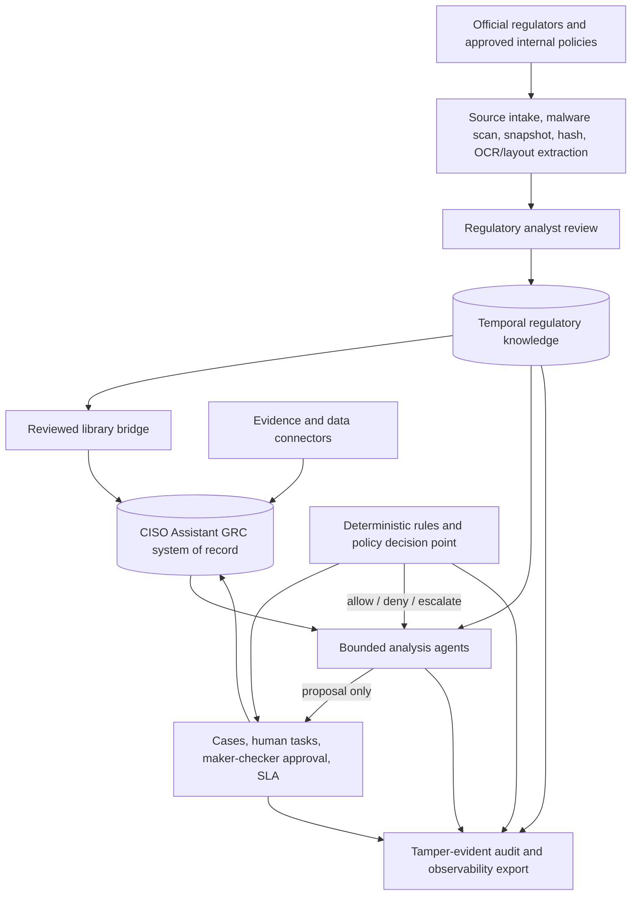

# Target architecture

## Architecture decision

CISO Assistant remains the GRC system of record for controls, assessments,
evidence, findings, risks, actors, folders, and validation flows. A dedicated
regulatory knowledge layer is proposed beside the existing library model instead
of forcing legal documents into cybersecurity framework objects.

## Layer responsibilities

| Layer | Authoritative for | Must not do |
| --- | --- | --- |
| Source intake | source URL, bytes, content hash, retrieval time, page/section anchors | treat webpage instructions as executable prompts |
| Regulatory knowledge | document versions, provisions, obligations, applicability, deadlines, legal provenance | silently overwrite a previous legal version |
| CISO Assistant | controls, implementation, assessments, evidence, findings, risks, ownership | become the only copy of legal source text or applicability logic |
| Rules/policy | thresholds, date arithmetic, scoring, routing, permissions, action gates | infer law from natural language |
| Agent | extraction proposals, comparison, explanation, draft artifacts | perform consequential writes or final legal approval |
| Workflow | human tasks, segregation of duties, approval, escalation, SLA | allow an agent to approve its own proposal |
| Evidence connectors | observed facts and signed/hash-addressed artifacts | declare a legal or audit conclusion from one scan |
| Audit/telemetry | inputs, citations, rules, approvals, tool calls, outcomes, cost | store hidden model chain-of-thought or unredacted secrets |

## Fit with the current repository

CISO Assistant already provides several strong foundations:

- `StoredLibrary`, `LoadedLibrary`, `Framework`, `RequirementNode`, and
  `ReferenceControl` for reviewed control content;
- `ComplianceAssessment` and `RequirementAssessment` for assessment state;
- `AppliedControl`, `Evidence`, `EvidenceRevision`, `Finding`, and task models
  for implementation and remediation;
- folder-scoped IAM and validation flows;
- an AI chat layer based on deterministic pre-routing, permission-filtered
  retrieval, and proposals rather than direct mutation;
- workflow scaffolding and structured application logging. Audit-log and
  service-account features have edition dependencies, so production must
  explicitly select an edition or provide equivalent external controls.

The extension should preserve those boundaries.

## Implemented Phase 1 boundary

The current as-built regulatory layer is the bounded `backend/regulatory`
Django app. It owns a synthetic, metadata-only Document -> DocumentVersion ->
Provision -> Obligation aggregate, entity registration, append-only non-binding
review events, controlled recorded-time correction, and current/historical
read selection. CISO Assistant continues to own users, service accounts,
folders, IAM, and the synthetic `tprm.Entity`; no parallel IAM, workflow, or GRC
store is introduced.

The public `/api/regulatory/v1/` surface remains read-only. Its detail operation
accepts an optional timezone-aware `recorded_as_of`, resolves one coherent
folder-consistent revision chain with half-open recorded intervals, and limits
review events to the same selection time. The detail path preserves both object
IAM and related-field masking. Missing or ambiguous aggregates fail closed.

Recorded-time repair is an internal deterministic domain operation, not an
agent or public write endpoint. A named human with the folder-scoped correction
permission may submit one complete typed successor set for a `SYNTHETIC-*`
entity. The transaction locks the actor, entity/folder, registration and full
aggregate, chooses one server cutoff, closes all three current revisions, adds
linked successors, and records an immutable correction event with semantic
before/after hashes. Corrected obligations restart at `machine_proposed`, so a
previous review cannot silently endorse new content.

The folder is the aggregate concurrency boundary. Mutations acquire it before
child rows; detail reads acquire the same lock before capturing their selection
time. Review/correction timestamps advance after the aggregate's latest known
recorded event, and reads floor wall time at the latest committed aggregate
time. This provides a defined before-or-after result for a concurrent current
read and correction and prevents clock rollback from hiding committed state.
PostgreSQL two-connection and query-plan evidence remains an external
production gate; SQLite tests are not a substitute for it.

This as-built subset does not own source bytes or legal supersession,
applicability, binding decisions, approval/publication, real institution facts,
library projections, UI writes, or agent execution. Those remain target
components gated by the delivery roadmap. The exact correction decision is in
[ADR 0002](adr/0002-recorded-time-correction.md).

## New logical components

### 1. Regulatory source service

The service creates append-only version records. Where storage rights permit,
it also retains an integrity-protected source snapshot and can apply WORM
retention. Every version records at least:

- issuer, document number, authority level, jurisdiction, and source URL;
- issue, publication, effective, transition, repeal, source-check, and recorded
  timestamps;
- content hash and extraction location;
- status such as draft, future-effective, effective, superseded, or repealed;
- metadata confidence, retrieval method, and legal-review state.

Production ingestion must use an approved domain allowlist. An untrusted page
may contribute content but never instructions to an agent or tool.

### 2. Temporal regulatory knowledge

Two time axes are required:

- **valid time**: when a rule is legally effective;
- **recorded time**: when the organisation learned or recorded it.

This supports questions such as "what applied to the transaction on that day?"
and "what did the organisation know when it approved the control?" without
rewriting history.

### 3. Library bridge

Only reviewed obligations are projected into CISO Assistant:

- a regulatory document or obligation set becomes a `Framework`;
- hierarchy and assessable obligations become `RequirementNode` records;
- reusable organisational safeguards become `ReferenceControl` records;
- obligation-to-control mappings remain traceable to the regulatory record ID;
- library publication uses the existing loader, URNs, versions, dependencies,
  and update path.

The bridge is one-way for authoritative regulatory content. Assessment results
can be linked back, but user edits to a framework must not mutate the official
source snapshot.

### 4. Action policy gateway

Every state-changing tool call receives a decision before execution. The input
contract includes:

- authenticated human and workload identity;
- tenant/domain/folder, legal entity, and case scope;
- data classification and regulatory domain;
- proposed action, target, payload digest, and idempotency key;
- originating evidence, agent/prompt version, and approval record;
- monetary/customer impact and reversibility.

The output is `allow`, `deny`, or `escalate`, with policy IDs and reasons. A
model instruction cannot override this decision.

### 5. Case workflow

Simple proposal confirmation can continue to use the existing chat and
validation-flow patterns. Higher-risk regulatory cases need explicit states,
including intake, analyst review, legal review, control-owner response,
independent challenge, approval, publication, monitoring, and closure.

Use deterministic workflow state for:

- regulatory change assessment;
- policy exception and waiver management;
- data-transfer and privacy impact assessment;
- high-risk AI approval;
- incident reporting to multiple regulators;
- audit finding validation and remediation;
- expenditure and procurement approvals.

## Deployment zones

At minimum, separate these trust zones:

1. source ingestion and document quarantine;
2. regulatory and CISO Assistant application services;
3. model inference and vector stores;
4. tool/evidence connectors;
5. audit export and security monitoring.

Customer, employee, transaction, and sensitive internal data must not be sent
to an overseas model endpoint until privacy, secrecy, data-security, and
cross-border requirements have been assessed. Prefer on-premise or approved
VPC inference, local keys, tenant isolation, DLP, and explicit retention.

## Three lines of defence

The evidence platform may be shared, but execution and assurance must remain
independent:

- first line owns and operates controls;
- second line defines requirements, challenges, and monitors;
- third line independently selects tests and signs audit conclusions.

The same agent identity, credentials, prompt, and approval path must not both
operate a first-line control and issue a third-line independent conclusion.

## Architecture acceptance criteria

- Every conclusion can resolve to an official source, version, provision, and
  reviewed obligation.
- Future-effective rules create preparation work but never a false "current
  violation".
- All formulas and statutory thresholds are recomputed by code or decision
  tables, not trusted from model output.
- All writes are permission checked, policy checked, idempotent, and audited.
- High-impact outcomes require an accountable human decision.
- A prior legal version, source hash, decision, evidence revision, or approval
  cannot be silently replaced.
- Cost telemetry is available by case, agent, model, and outcome without
  leaking regulated data.
