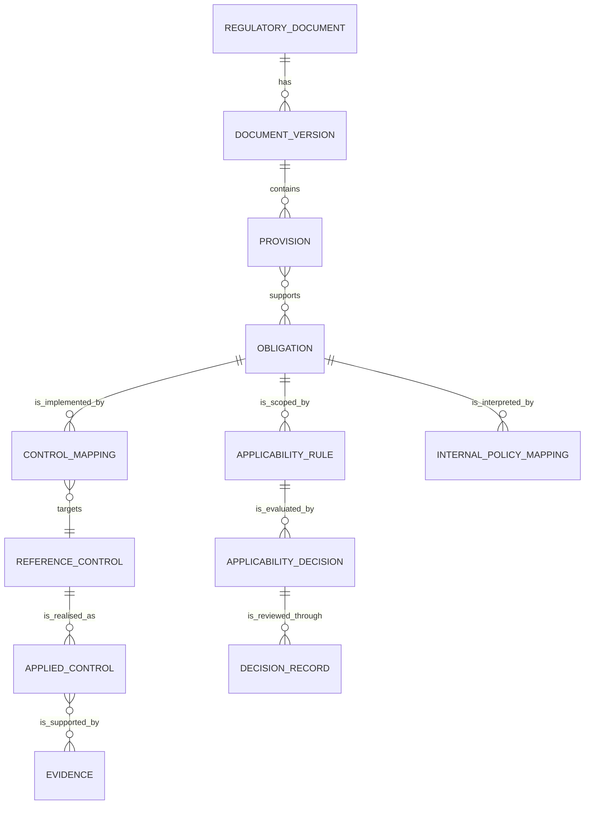

# Regulatory domain model

## Why a separate model is required

CISO Assistant frameworks are well suited to assessments, but a legal rule has
additional semantics: authority, jurisdiction, legal status, valid time,
supersession, applicability, trigger conditions, deadlines, penalties, and
verbatim source anchors. These must survive even when the same obligation maps
to several controls or internal policies.

The proposed model therefore keeps regulatory knowledge authoritative and
projects reviewed content into existing GRC objects.

## Core relationship



## Entities

### RegulatoryDocument

Stable identity for an instrument independent of its versions.

Required concepts:

- issuer and stable title;
- authority level: law, administrative regulation, departmental rule,
  regulatory document, mandatory standard, recommended standard, internal
  policy, enforcement/interpretive material;
- territory and regulated licence/entity scope;
- territory, regulated-entity scope, and domain classification.

### DocumentVersion

Append-only record of one source version.

- document number, issue/publication/effective/transition/repeal dates;
- status and supersession links;
- source URL, metadata confidence, legal-review state, recorded time, and bytes
  hash where a snapshot is permitted;
- extraction version and reviewer;
- original attachment plus page/section addressing.

### Provision

Source-faithful article, paragraph, table row, or annex item.

- article/section label and heading;
- exact text where storage/redistribution is permitted;
- page, bounding box, DOM selector, or other source locator;
- content hash;
- no inferred duty mixed into the original text.

### Obligation

Reviewed normative proposition derived from one or more provisions.

- subject, modality, action, object, trigger, exception, deadline, and penalty;
- responsible and reviewing functions;
- expected evidence and retention period;
- confidence and review state;
- model/prompt provenance for machine-proposed records;
- explicit distinction between legal duty, supervisory expectation,
  recommended standard, and organisation-defined requirement.

An obligation becomes operational only after human review.

### RegulatoryChainCorrectionEvent

Implemented audit boundary for one recorded-time repair of the current
DocumentVersion -> Provision -> Obligation revision set.

- exact predecessor and successor references for all three records;
- server-owned cutoff time shared by predecessor closure and successor start;
- authenticated named-human actor, rationale, and folder-scoped idempotency
  key;
- canonical request, before-state, and after-state SHA-256 digests;
- correction kind fixed to `recorded_time` and publication fixed to false.

The event does not mean that an authority changed, amended, repealed, or
superseded a legal instrument. Source/legal-version supersession needs a
separate future contract with source evidence and legal review.

### RegulatoryApplicabilityDecision (implemented bounded persistence)

The implemented Phase 1 slice represents one synthetic applicability fact
snapshot and its deterministic result in one append-only aggregate. Additive
migration `regulatory.0003` creates the table without backfilling decisions or
institution facts.

Each revision contains:

- one `EntityDocumentRegistration` and the exact physical
  `RegulatoryObligation` row evaluated, both in the same folder;
- fixed rule `SYNTHETIC-ENTITY-INSTITUTION-TYPE-BANK-001` version 1 with the
  single condition `entity.institution_type eq "bank"`;
- a canonical observation for that fact, including known/unknown state, value,
  evidence references, and observation time;
- the service-computed `applicable`, `not_applicable`, or `needs_review`
  result, structured reasons, valid time, and provenance;
- portable decision ID, revision, predecessor, half-open recorded interval,
  actor, rationale, idempotency key, and versioned request/rule/fact/semantic
  digests; and
- fixed `draft`, non-binding, and unpublished state.

The caller cannot replace the rule or choose the result. Known `"bank"`
computes `applicable`; another known non-matching institution type computes
`not_applicable`; missing or unknown input computes `needs_review`. A known
fact requires a registered type, non-empty evidence references, and an
observation time. An unknown fact carries no asserted value or fabricated
evidence.

Fact corrections replace the complete snapshot. The service compare-and-swaps
the current revision and semantic digest, closes it at one server-owned cutoff,
and appends a direct successor. The decision row is also the durable command
result: it records the actor, rationale, cutoff, predecessor, idempotency
binding, and canonical digests, so a separate correction-event table is not
needed for this non-binding slice.

The exact physical obligation is a prerequisite, not merely a portable string
reference. Effective recorded-time selection uses the intersection of the
decision interval and that obligation revision's interval. If obligation r1 is
corrected to r2, an r1 decision is not inherited or copied. The old row may
remain the last open recorded belief about historical r1, but exact-parent
selection excludes it from r2. The new obligation safely returns unevaluated /
`needs_review` until a fresh decision is recorded. Consequently the existing
three-row chain correction does not cascade-close applicability history.

The entity-scoped read contract requires explicit entity identity, document
and entity IAM, and `view_regulatoryapplicabilitydecision`. Mutation remains an
internal service guarded by `record_regulatoryapplicability`; no public write,
confirmation, approval, publication, real-entity fact, or agent capability is
introduced.

### RegulatoryApplicabilityReviewDisposition (accepted design; persistence pending)

The accepted next model design is an append-only human disposition stream
for one exact physical `RegulatoryApplicabilityDecision` revision. It remains
separate from the decision so human review cannot mutate the deterministic
facts, result, rationale, or semantic digest.

Each future disposition contains:

- a `PROTECT` FK to the exact physical decision and a copied,
  server-recomputed decision semantic digest;
- the decision maker copied from `decision.recorded_by` and a distinct
  named-human reviewer;
- sequence and direct predecessor disposition, `from_disposition`,
  `to_disposition`, controlled reason code, required rationale, and
  server-owned `occurred_at`;
- fixed digest profile, event and request digests, and a folder-scoped
  idempotency key; and
- fixed non-binding and unpublished state.

The derived initial state is `not_reviewed`. Persisted dispositions are
`no_correction_requested`, `correction_requested`, and
`unable_to_complete`. Any persisted disposition may be replaced through an
append-only successor. A same-disposition successor requires a materially
different controlled reason or rationale and exact predecessor CAS; an exact
semantic no-op is rejected. This lets a reviewer correct an earlier human event
without deleting history or minting a semantically identical applicability
decision.

`no_correction_requested` means only that the reviewer did not request a
correction to the exact stored synthetic record. It does not confirm legal
applicability, evidence authenticity or sufficiency, source review, the rule,
or compliance. `correction_requested` routes work but cannot change the
decision; the existing applicability service owns any successor fact snapshot.
`unable_to_complete` keeps insufficient or conflicting review conditions
visible and fail-closed.

New events require a current exact-parent decision and a reviewer different
from its recorder. A corrected decision starts `not_reviewed`; old dispositions
remain attached only to the old physical revision. The accepted future read
contract is entity scoped and read-only, with independent view/review
permissions. No model, migration, service, or API for this entity is implemented
yet. See
[ADR 0004](adr/0004-bounded-synthetic-applicability-review-disposition.md).

### ApplicabilityRule (target model)

Structured conditions determining whether an obligation applies. Dimensions
include:

- legal entity, ownership/listing status, licence, regulator, and territory;
- product, channel, business process, and customer type;
- data category, sensitivity, subject count, location, and transfer route;
- system type, MLPS level, critical-infrastructure status, and cloud model;
- AI use case, autonomy, customer impact, model risk, and explainability;
- outsourcing/materiality and third-party role.

The rule contains versioned deterministic conditions and defines the safe
unknown result. Each material revision mints a new record ID, increments the
version, and links its predecessor; this keeps decision targets unambiguous. A
rule does not itself claim that a legal entity, product, system, or data flow is
in scope.

### ApplicabilityDecision (target model)

Scoped evaluation of a specific obligation and rule version.

- legal entity, product, system, process, data flow, or customer-segment scope;
- the fact snapshot and evidence references used for evaluation;
- `applicable`, `not_applicable`, or `needs_review` result;
- rationale, valid/recorded time, provenance, and confirmation state.

Unknown facts referenced by the rule must never silently become
`not_applicable`. A draft or machine proposal is not a legal applicability
conclusion.

Evaluation uses three-value logic. A missing or explicitly unknown fact is
`unknown`; AND returns false when any input is false before propagating unknown,
and OR returns true when any input is true before propagating unknown. When a
rule contains both groups, every `all` condition and at least one `any`
condition must hold. The computed states map only to `applicable`,
`not_applicable`, and `needs_review`; a supplied result is rejected when it
does not match recomputation. Known facts require registered types, evidence,
and observation time.

### ControlMapping

Reviewed relationship between an obligation and a reference control.

- mapping type: implements, partially implements, supports, or conflicts;
- owner, reviewer, test frequency, evidence expectations, and rationale;
- effective interval and mapping version;
- mapped CISO Assistant control URN.

### DecisionRecord

Human-accountable disposition of a proposal.

- proposal digest and cited sources;
- rule/policy decisions;
- maker, checker, approver, timestamps, and role separation;
- decision, rationale, conditions, expiry, and revocation;
- links to resulting CISO Assistant objects and audit events.

## Projection into current CISO Assistant objects

| Regulatory concept | Existing object | Projection rule |
| --- | --- | --- |
| reviewed obligation set | `Framework` | one published, versioned assessment view |
| hierarchy / non-normative heading | `RequirementNode(assessable=false)` | navigation only |
| reviewed assessable obligation | `RequirementNode(assessable=true)` | retains external regulatory ID in the bridge |
| reusable safeguard | `ReferenceControl` | organisation-oriented control, not copied law text |
| implemented safeguard | `AppliedControl` | owner, status, cost, dates, assets, policies |
| assessment | `ComplianceAssessment` | scoped to folder/perimeter/entity |
| obligation result | `RequirementAssessment` | implementation result, not legal applicability itself |
| supporting artifact | `Evidence` / `EvidenceRevision` | status, owner, hash, version, expiry |
| gap or exception | `Finding` / exception objects | remediation and due date |
| approval | validation flow / workflow task | links to an append-only decision record |

## Internal regulation mapping

Internal policy is modelled separately from external regulation even when both
are projected as assessment frameworks. Each internal clause can map to zero or
more external obligations:

- `implements`: the clause operationalises the obligation;
- `exceeds`: the internal clause is intentionally stricter;
- `partial`: one or more required elements are missing;
- `conflicts`: following the clause may breach or frustrate the obligation;
- `organisation_defined`: no external parent; retained as a management choice.

An internal policy may be stricter, but it cannot reduce a mandatory external
obligation. Conflict resolution creates a reviewed case; an agent does not
silently choose a winner.

## Temporal rules

Every versioned entity uses half-open validity intervals:

```text
[valid_from, valid_to)
[recorded_from, recorded_to)
```

`valid_to = null` means no known legal end. `recorded_to = null` means the row
is the current recorded belief. A recorded-time correction closes the current
DocumentVersion, Provision, and Obligation at one server cutoff and appends
direct successors beginning at that cutoff. It preserves portable record IDs,
increments revisions, and never overwrites prior payload. Selection at the
cutoff returns the successor; selection immediately before it returns the
predecessor.

For the implemented synthetic aggregate, current reads and corrections lock the
same folder boundary before their selection/cutoff time. The historical selector
then applies one timestamp to a joined citation chain and to its review events,
so it cannot combine revisions from different recorded states. This lock and
query contract still requires PostgreSQL concurrency and query-plan validation
before production acceptance.

For the implemented synthetic applicability slice, the selector uses the same
timestamp to resolve the parent chain and an entity-scoped decision linked to
the selected physical obligation. Its effective recorded interval is:

```text
decision interval intersect exact obligation interval
```

This parent interval prevents an r1 decision from appearing on an r2
obligation without requiring the chain correction to close or clone dependent
decisions. Missing decisions and missing or unknown facts resolve to
`needs_review`, never `not_applicable`.

For the accepted review-disposition design, point-in-time selection first
resolves that exact applicability decision and then selects its latest event
with `occurred_at <= recorded_as_of`. The disposition event is not copied to a
successor decision. Its time joins the document aggregate floor so a later
decision, obligation review, or correction cannot be recorded before committed
review history under host-clock rollback.

## Provenance rules

For every machine-proposed provision, obligation, mapping, or conclusion,
retain:

- source document/version and locator;
- source content hash;
- extraction/parser version;
- model, prompt, schema, and retrieval configuration version;
- time and initiating identity;
- confidence and validation errors;
- reviewer and review outcome.

Do not store private chain-of-thought. Store structured reasons, citations,
rule hits, and human rationale that can be independently examined.

## Interchange contract

[`schemas/regulatory-record.schema.json`](schemas/regulatory-record.schema.json)
defines the portable `2.0.0-draft.1` contract. Its `draft` status is explicit;
breaking changes remain possible until production consumers and migrations are
defined. It is deliberately independent of Django models so it can be reviewed,
tested, and exchanged before database migrations are committed.

## Current implementation boundary

The verified Phase 1 Django implementation persists the synthetic,
metadata-only Document -> DocumentVersion -> Provision -> Obligation subset,
entity registration, non-binding review events, and the recorded-time
correction event described above. The read-only detail API supports coherent
`recorded_as_of` retrieval. A corrected obligation always restarts as
`machine_proposed`; previous review events remain historical and do not transfer
to the successor.

It also persists the single-model synthetic applicability boundary described
above and exposes its entity-scoped read-only GET operation. Mutation is
available only through the named-human internal service; there is no public
write route. The general multi-rule/multi-scope models remain target design.
Neither boundary adds control or policy mappings, `DecisionRecord` approval,
source/legal supersession, source text, approval/publication, real institution
facts, or agents.

The full regulatory SQLite suite passes all 41 tests both with migrations
disabled and through the real project migration graph.
An independent full-project SQLite rehearsal verified 0003 apply,
empty-history rollback/reapply, and refusal to reverse populated applicability
history. Django checks, migration-drift checks, and an independent review with
no critical, high, or medium findings also pass. PostgreSQL apply,
two-connection locking, representative query plans, backup/restore, database
roles, and audit retention remain external gates. See
[ADR 0002](adr/0002-recorded-time-correction.md) for the verified correction
contract and [ADR 0003](adr/0003-bounded-synthetic-applicability-persistence.md)
for the bounded applicability contract and migration guard.

The independent review-disposition entity described above is accepted as the
next architecture boundary; it is not implemented or migration-verified.
It adds no legal approval, publication, real fact, UI, public mutation, generic
workflow, or agent claim. Its accepted contract and pending gates are in
[ADR 0004](adr/0004-bounded-synthetic-applicability-review-disposition.md).
