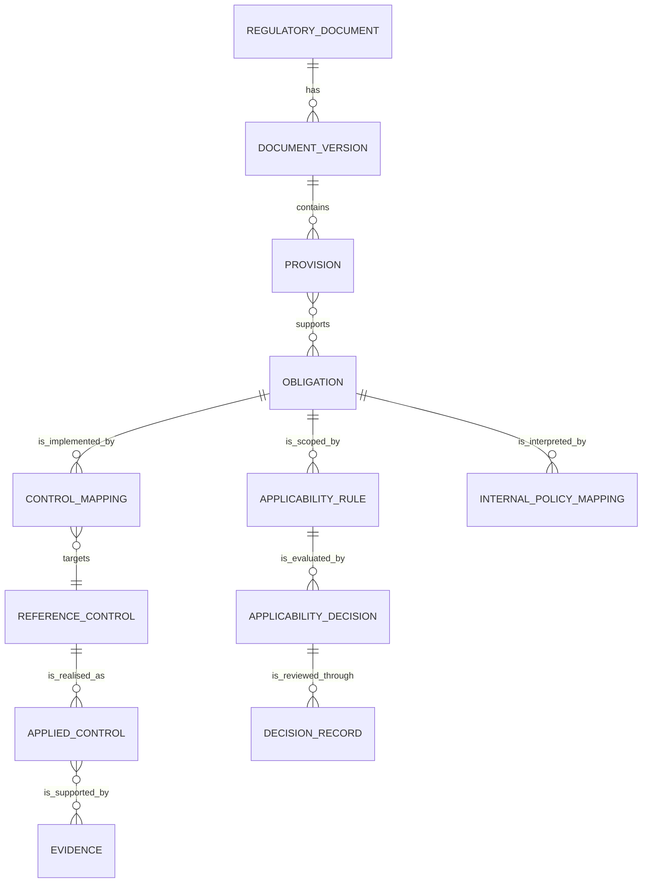

# Regulatory domain model

## Why a separate model is required

CISO Assistant frameworks are well suited to assessments, but a legal rule has
additional semantics: authority, jurisdiction, legal status, valid time,
supersession, applicability, trigger conditions, deadlines, penalties, and
verbatim source anchors. These must survive even when the same obligation maps
to several controls or internal policies.

The proposed model therefore keeps regulatory knowledge authoritative and
projects reviewed content into existing GRC objects.

## Core relationship



## Entities

### RegulatoryDocument

Stable identity for an instrument independent of its versions.

Required concepts:

- issuer and stable title;
- authority level: law, administrative regulation, departmental rule,
  regulatory document, mandatory standard, recommended standard, internal
  policy, enforcement/interpretive material;
- territory and regulated licence/entity scope;
- territory, regulated-entity scope, and domain classification.

### DocumentVersion

Append-only record of one source version.

- document number, issue/publication/effective/transition/repeal dates;
- status and supersession links;
- source URL, metadata confidence, legal-review state, recorded time, and bytes
  hash where a snapshot is permitted;
- extraction version and reviewer;
- original attachment plus page/section addressing.

### Provision

Source-faithful article, paragraph, table row, or annex item.

- article/section label and heading;
- exact text where storage/redistribution is permitted;
- page, bounding box, DOM selector, or other source locator;
- content hash;
- no inferred duty mixed into the original text.

### Obligation

Reviewed normative proposition derived from one or more provisions.

- subject, modality, action, object, trigger, exception, deadline, and penalty;
- responsible and reviewing functions;
- expected evidence and retention period;
- confidence and review state;
- model/prompt provenance for machine-proposed records;
- explicit distinction between legal duty, supervisory expectation,
  recommended standard, and organisation-defined requirement.

An obligation becomes operational only after human review.

### ApplicabilityRule

Structured conditions determining whether an obligation applies. Dimensions
include:

- legal entity, ownership/listing status, licence, regulator, and territory;
- product, channel, business process, and customer type;
- data category, sensitivity, subject count, location, and transfer route;
- system type, MLPS level, critical-infrastructure status, and cloud model;
- AI use case, autonomy, customer impact, model risk, and explainability;
- outsourcing/materiality and third-party role.

The rule contains versioned deterministic conditions and defines the safe
unknown result. Each material revision mints a new record ID, increments the
version, and links its predecessor; this keeps decision targets unambiguous. A
rule does not itself claim that a legal entity, product, system, or data flow is
in scope.

### ApplicabilityDecision

Scoped evaluation of a specific obligation and rule version.

- legal entity, product, system, process, data flow, or customer-segment scope;
- the fact snapshot and evidence references used for evaluation;
- `applicable`, `not_applicable`, or `needs_review` result;
- rationale, valid/recorded time, provenance, and confirmation state.

Unknown facts referenced by the rule must never silently become
`not_applicable`. A draft or machine proposal is not a legal applicability
conclusion.

Evaluation uses three-value logic. A missing or explicitly unknown fact is
`unknown`; AND returns false when any input is false before propagating unknown,
and OR returns true when any input is true before propagating unknown. When a
rule contains both groups, every `all` condition and at least one `any`
condition must hold. The computed states map only to `applicable`,
`not_applicable`, and `needs_review`; a supplied result is rejected when it
does not match recomputation. Known facts require registered types, evidence,
and observation time.

### ControlMapping

Reviewed relationship between an obligation and a reference control.

- mapping type: implements, partially implements, supports, or conflicts;
- owner, reviewer, test frequency, evidence expectations, and rationale;
- effective interval and mapping version;
- mapped CISO Assistant control URN.

### DecisionRecord

Human-accountable disposition of a proposal.

- proposal digest and cited sources;
- rule/policy decisions;
- maker, checker, approver, timestamps, and role separation;
- decision, rationale, conditions, expiry, and revocation;
- links to resulting CISO Assistant objects and audit events.

## Projection into current CISO Assistant objects

| Regulatory concept | Existing object | Projection rule |
| --- | --- | --- |
| reviewed obligation set | `Framework` | one published, versioned assessment view |
| hierarchy / non-normative heading | `RequirementNode(assessable=false)` | navigation only |
| reviewed assessable obligation | `RequirementNode(assessable=true)` | retains external regulatory ID in the bridge |
| reusable safeguard | `ReferenceControl` | organisation-oriented control, not copied law text |
| implemented safeguard | `AppliedControl` | owner, status, cost, dates, assets, policies |
| assessment | `ComplianceAssessment` | scoped to folder/perimeter/entity |
| obligation result | `RequirementAssessment` | implementation result, not legal applicability itself |
| supporting artifact | `Evidence` / `EvidenceRevision` | status, owner, hash, version, expiry |
| gap or exception | `Finding` / exception objects | remediation and due date |
| approval | validation flow / workflow task | links to an append-only decision record |

## Internal regulation mapping

Internal policy is modelled separately from external regulation even when both
are projected as assessment frameworks. Each internal clause can map to zero or
more external obligations:

- `implements`: the clause operationalises the obligation;
- `exceeds`: the internal clause is intentionally stricter;
- `partial`: one or more required elements are missing;
- `conflicts`: following the clause may breach or frustrate the obligation;
- `organisation_defined`: no external parent; retained as a management choice.

An internal policy may be stricter, but it cannot reduce a mandatory external
obligation. Conflict resolution creates a reviewed case; an agent does not
silently choose a winner.

## Temporal rules

Every versioned entity uses half-open validity intervals:

```text
[valid_from, valid_to)
[recorded_from, recorded_to)
```

`valid_to = null` means no known legal end. `recorded_to = null` means the row
is the current recorded belief. Corrections create new recorded versions; they
do not mutate history.

## Provenance rules

For every machine-proposed provision, obligation, mapping, or conclusion,
retain:

- source document/version and locator;
- source content hash;
- extraction/parser version;
- model, prompt, schema, and retrieval configuration version;
- time and initiating identity;
- confidence and validation errors;
- reviewer and review outcome.

Do not store private chain-of-thought. Store structured reasons, citations,
rule hits, and human rationale that can be independently examined.

## Interchange contract

[`schemas/regulatory-record.schema.json`](schemas/regulatory-record.schema.json)
defines the portable `2.0.0-draft.1` contract. Its `draft` status is explicit;
breaking changes remain possible until production consumers and migrations are
defined. It is deliberately independent of Django models so it can be reviewed,
tested, and exchanged before database migrations are committed.
