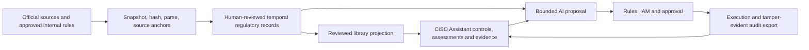

# Reference architecture

> **Proposed design:** CISO Assistant remains the GRC system of record. A new
> regulatory layer preserves legal source, version, applicability, and
> provenance before reviewed obligations are projected into frameworks.

> **Current Phase 1 subset:** the regulatory layer persists one synthetic,
> metadata-only Document -> Version -> Provision -> Obligation chain. Its public
> API is read-only. Applicability, legal supersession, approval/publication,
> source text, real-institution facts, projections, and agents remain proposed.

## Current recorded-time contract

A named human with folder-scoped correction authority can invoke the internal
regulatory service to repair one current synthetic chain. The transaction locks
the folder and full aggregate, chooses one server time, closes the three current
recorded intervals, appends directly linked successors, and records an
idempotent audit event with rationale and before/after hashes. The service is
metadata-only and cannot claim that a regulator issued or superseded a legal
version. A corrected obligation returns to `machine_proposed`, so prior review
does not silently carry forward.

Document detail accepts an optional timezone-aware `recorded_as_of` value. It
uses half-open intervals and one joined citation chain, applies the same time to
review events, and returns no result when history is missing or inconsistent.
The read path locks the same folder before capturing its selection time, so a
concurrent current read is defined wholly before or after a correction. Object
and related-field IAM continue to apply to the custom response.

These behaviours are tested on the project's SQLite path. PostgreSQL migration,
two-connection concurrency, and representative query-plan evidence remain
production acceptance gates. The durable contract and rollback boundary are in
[ADR 0002](../../../documentation/china-financial-grc/adr/0002-recorded-time-correction.md).

## Trust boundaries

- Source content is untrusted data and cannot supply tool or system
  instructions.
- Regulatory records preserve valid time and recorded time; old versions are
  never silently replaced.
- Models extract, compare, explain, and draft. Code or decision tables calculate
  dates, thresholds, grades, permissions, and workflow routes.
- Every write is permission checked, policy checked, bound to an exact proposal
  digest, idempotent, approved where required, and audited.
- Evidence connectors provide observed facts; they do not issue legal or audit
  conclusions.
- First-line control operation and third-line independent assurance use
  separate identities, permissions, prompts, and approval paths.

## Data-location rule

Prompts, retrieved text, traces, and tool arguments are data flows. Customer,
employee, transaction, and sensitive internal information cannot be sent to an
overseas model endpoint until the relevant privacy, secrecy, data-security, and
cross-border analysis is approved.

Prefer approved on-premise or VPC inference, local key control, tenant
isolation, DLP, explicit retention, and independently exported audit records.

## Edition dependencies

Some CISO Assistant service-account and audit capabilities differ between
community and commercial editions. A production design must explicitly select
the edition or provide equivalent controls. It must not assume a blueprint
feature is available merely because a related product page exists.
