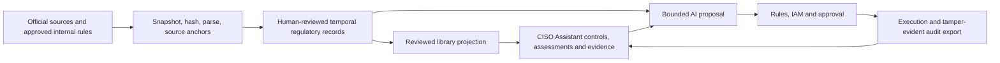

# Reference architecture

> **Proposed design:** CISO Assistant remains the GRC system of record. A new
> regulatory layer preserves legal source, version, applicability, and
> provenance before reviewed obligations are projected into frameworks.

> **Current Phase 1 subset:** the regulatory layer persists one synthetic,
> metadata-only Document -> Version -> Provision -> Obligation chain plus one
> append-only applicability-decision aggregate. Its public API is read-only.
> Applicability remains draft, non-binding, unpublished, and limited to a fixed
> rule and synthetic observations. Legal supersession, approval/publication,
> source text, real-institution facts, projections, and agents remain proposed.



## Current recorded-time contract

A named human with folder-scoped correction authority can invoke the internal
regulatory service to repair one current synthetic chain. The transaction locks
the folder and full aggregate, chooses one server time, closes the three current
recorded intervals, appends directly linked successors, and records an
idempotent audit event with rationale and before/after hashes. The service is
metadata-only and cannot claim that a regulator issued or superseded a legal
version. A corrected obligation returns to `machine_proposed`, so prior review
does not silently carry forward.

Document detail accepts an optional timezone-aware `recorded_as_of` value. It
uses half-open intervals and one joined citation chain, applies the same time to
review events, and returns no result when history is missing or inconsistent.
The read path locks the same folder before capturing its selection time, so a
concurrent current read is defined wholly before or after a correction. Object
and related-field IAM continue to apply to the custom response.

These behaviours are tested on the project's SQLite path. PostgreSQL migration,
two-connection concurrency, and representative query-plan evidence remain
production acceptance gates. The durable contract and rollback boundary are in
[ADR 0002](../../../documentation/china-financial-grc/adr/0002-recorded-time-correction.md).

## Implemented synthetic applicability contract

The bounded Phase 1 implementation uses one append-only decision aggregate
rather than a general rule, fact, approval, and evidence subsystem. It is
limited to an explicit synthetic legal entity and the exact physical obligation
revision selected from its registered document.

The embedded rule is
`SYNTHETIC-ENTITY-INSTITUTION-TYPE-BANK-001` version 1. Its only condition is
`entity.institution_type eq "bank"`. A known matching value computes
`applicable`, another known non-matching value computes `not_applicable`, and a
missing or unknown fact computes `needs_review`. The service records the exact
fact snapshot, evidence references, provenance, rule and fact digests, and the
deterministic result. The caller cannot replace the rule or choose a result.

The public operation is read-only and requires an explicit entity:

```text
GET /api/regulatory/v1/documents/{uuid}/applicability/?entity=<uuid>&recorded_as_of=<aware-RFC-3339>
```

It applies document and entity IAM and a separate
`view_regulatoryapplicabilitydecision` permission. Recording or correcting a
snapshot remains an internal, folder-scoped service protected by
`record_regulatoryapplicability`; there is no public write action.

Recorded-time lookup first selects the exact obligation revision and then only
a decision linked to that physical row. If obligation r1 is corrected to r2,
the r1 decision remains historical and does not attach to r2. The chain
correction does not cascade-close it: the effective interval is the
intersection of the decision and exact parent-obligation intervals. Until r2
is evaluated afresh, the API reports it as unevaluated and safely resolves it
to `needs_review`.

This implementation does not add a general ApplicabilityRule approval lifecycle,
binding legal decisions, confirmation/publication, real institution facts,
source text, agents, or library projections. Migration `regulatory.0003` adds
the table without a data backfill. The full regulatory SQLite suite passes all
41 tests both with migrations disabled and through the real project migration
graph; an independent full-project SQLite migration rehearsal verified 0003
apply, empty-history rollback/reapply, and populated-history reverse refusal.
Django checks, migration-drift checks, and an independent review reporting no
critical, high, or medium findings also pass.

PostgreSQL apply, two-connection lock evidence, representative query plans,
backup/restore, database-role enforcement, and audit-retention evidence remain
external production gates. The durable design and alternatives are in
[ADR 0003](../../../documentation/china-financial-grc/adr/0003-bounded-synthetic-applicability-persistence.md).

## Accepted applicability review-disposition contract

The accepted next architecture design defines, but does not yet implement, one
independent append-only review-disposition stream for the exact synthetic
applicability decision and its semantic digest. Its only persisted targets are
`no_correction_requested`, `correction_requested`, and
`unable_to_complete`; no event derives or overrides the computed applicability
result. Absence of an event derives the initial `not_reviewed` state.

This is a maker/checker record, not legal approval. The named human who recorded
the fact snapshot cannot review that exact revision. Analyst and Domain Manager
remain recorders, Approver is the bounded reviewer, and Administrator still
cannot self-review. Service accounts are excluded. Reviewer identity and
rationale require a separate disposition-view permission under the immutable
entity-registration folder.

Decision and obligation corrections never copy a disposition. A successor
decision starts `not_reviewed`; prior human events remain historical only on
their exact decision revision. A small predecessor/sequence stream lets a
reviewer append a correction to a mistaken prior disposition without deleting
audit history.

A future implementation remains public-read-only and may add this separate
action:

```text
GET /api/regulatory/v1/documents/{uuid}/applicability-review/
    ?entity=<uuid>&recorded_as_of=<aware-RFC-3339>
```

It first resolves the existing exact applicability decision, then selects its
latest authorised disposition at the same recorded time. The response keeps
`computed_non_binding_result`, human disposition, `legal_conclusion: false`,
and `is_binding: false` separate. There is no public review write, approval,
publication, real institution fact, workflow UI, projection, or agent in this
design. Implementation, migration, SQLite, and PostgreSQL verification remain
pending; the exact contract and alternatives are in
[ADR 0004](../../../documentation/china-financial-grc/adr/0004-bounded-synthetic-applicability-review-disposition.md).

## Trust boundaries

- Source content is untrusted data and cannot supply tool or system
  instructions.
- Regulatory records preserve valid time and recorded time; old versions are
  never silently replaced.
- Models extract, compare, explain, and draft. Code or decision tables calculate
  dates, thresholds, grades, permissions, and workflow routes.
- Every write is permission checked, policy checked, bound to an exact proposal
  digest, idempotent, approved where required, and audited.
- Evidence connectors provide observed facts; they do not issue legal or audit
  conclusions.
- First-line control operation and third-line independent assurance use
  separate identities, permissions, prompts, and approval paths.

## Data-location rule

Prompts, retrieved text, traces, and tool arguments are data flows. Customer,
employee, transaction, and sensitive internal information cannot be sent to an
overseas model endpoint until the relevant privacy, secrecy, data-security, and
cross-border analysis is approved.

Prefer approved on-premise or VPC inference, local key control, tenant
isolation, DLP, explicit retention, and independently exported audit records.

## Edition dependencies

Some CISO Assistant service-account and audit capabilities differ between
community and commercial editions. A production design must explicitly select
the edition or provide equivalent controls. It must not assume a blueprint
feature is available merely because a related product page exists.
